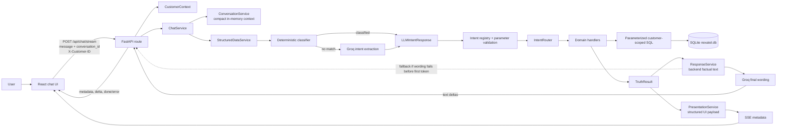

# NexaTel AI Support: Technical Workflow and Architecture

This document is a source-oriented guide to the NexaTel telecom customer-support chatbot. It is intended for a developer or AI coding agent that needs to understand the project before changing it. It explains the runtime workflow, data boundaries, backend and frontend responsibilities, supported domains, persistence, configuration, safety properties, verification strategy, and known limitations.

For customer-facing example questions, see [QUESTIONS.md](QUESTIONS.md). For the shorter project overview and setup instructions, see [README.md](README.md). This guide describes the repository as it is currently implemented; where code and high-level descriptions differ, the implementation details below call out the difference.

## 1. Product Scope and Core Design

NexaTel is a **read-only telecom account-support chatbot**. It can retrieve records and answer supported questions about a selected demo customer. It does not change customer accounts, execute payments, create support tickets, or diagnose live networks/devices.

The central design rule is:

> The language model may interpret wording and phrase the final response, but SQLite-backed backend handlers own customer facts, joins, calculations, reconciliation, and structured presentation data.

In practice, the pipeline is divided into two separate LLM responsibilities:

1. **Intent interpretation**: common requests may be recognized by deterministic classifiers; other wording is sent to Groq for a structured intent and typed parameters.
2. **Answer phrasing**: after the backend has produced a factual answer, Groq may rewrite that text for the customer. This second model call does not receive SQL access and is instructed not to change facts.

The backend never accepts a customer ID from free-form chat as authorization. The frontend's selected customer is passed separately in `X-Customer-ID`; handlers receive a validated `CustomerContext` and use its ID in scoped queries. This is a **development/demo account selector**, not production authentication.

## 2. System Shape



The frontend is a renderer and interaction layer. It does not query SQLite, calculate account values, choose customer-owned records, or infer values from prose. The backend resolves the request completely before streaming the final user-facing words.

## 3. End-to-End Chat Turn

### 3.1 Frontend setup and user action

The React app is bootstrapped from `frontend/src/main.tsx` and rendered by `frontend/src/App.tsx`.

1. The UI starts with `CUST001` selected and creates a conversation UUID (or a timestamp/random fallback).
2. It requests the selected customer's display name from `GET /api/chat/profile`. The name personalizes the welcome view; the account selector itself is separate.
3. On the welcome screen, suggested prompts can fill the chat flow. Once a turn exists, the UI renders the conversation, structured data, and message controls.
4. On submit, the UI trims the message, creates a local user message and an empty assistant message, marks the conversation busy, and calls `streamChatMessage` with the selected customer ID, message, conversation ID, and an `AbortSignal`.
5. The selected customer is sent as the `X-Customer-ID` HTTP header. The message body contains only `message` and `conversation_id`.
6. Changing customer clears local chat state, asks the backend to reset the old conversation context, and generates a new conversation ID. Starting a new conversation follows the same reset-and-new-ID pattern.
7. Stop/cancel aborts the browser request. Network/API errors are shown in the UI. Partial assistant text is retained if a stream fails after text has already arrived.

The frontend currently offers customer IDs `CUST001` through `CUST007`. The seed defines twenty demo customers (`CUST001` through `CUST020`), so the UI selector intentionally exposes only a subset at present.

### 3.2 HTTP request validation and trusted customer context

The active chat routes are defined in `backend/app/api/routes/chat.py`, mounted under `/api` by `backend/app/main.py`.

For chat requests, Pydantic's `ChatRequest` in `backend/app/models/api.py` requires:

- `message`: 1 to 4,000 characters.
- `conversation_id`: optional, 1 to 128 characters when provided.
- Extra JSON properties are forbidden.

`get_customer_context` constructs `CustomerContext` from `X-Customer-ID`. The immutable Pydantic model trims whitespace and requires a non-empty ID (up to 64 characters). This validates the shape of the selected ID, not the identity of the person making the request. The profile route subsequently looks the ID up in the database; chat handlers return not-found results if no matching customer records exist.

FastAPI's `get_db` dependency creates one SQLite connection for the request and closes it after request handling. The connection enables foreign keys, uses `sqlite3.Row`, and configures a 10-second busy timeout.

### 3.3 Conversation follow-up resolution

`ConversationService` stores a compact `ConversationContext`, not a transcript. It remembers fields such as the last intent/domain, a referenced bill/payment/ticket/device/subscription, a period, usage type, and a few support filters.

- State is kept in a process-local, lock-protected `OrderedDict`, capped at 500 conversation IDs using least-recently-used eviction.
- Each stored context is associated with a customer ID. If an ID is used with another customer, a fresh context is created rather than reusing the old customer's references.
- The context passed toward intent extraction is a compact key/value hint, not a message history.
- The resolver first checks whether a follow-up can be safely inferred from deterministic phrase classification and recent context. If it remains ambiguous, it creates a clarification rather than inventing a reference.
- Ambiguous, unsupported, validation-error, and database-error results do not become the new remembered successful context.
- Context is ephemeral: it is lost on process restart and is not shared across multiple server workers.

### 3.4 Intent selection

`ChatService` constructs an `IntentExtractor` and `IntentRouter` and delegates request execution to `StructuredDataService`.

`GroqLLMClient.extract_intent` first calls `classify_deterministic_request`. Current deterministic shortcuts include cross-domain/customer-360 wording, general payment-help clarification, known network/outage limitation requests, support tickets, devices, and common usage wording. Remaining wording falls through to Groq's intent prompt unless the configured model name contains `prompt-guard`; that special branch uses the deterministic classifier only and maps unrecognized wording to unsupported.

When Groq intent extraction is used:

- The system prompt is built from the registered intent catalog and the current application date.
- The prompt asks for exactly one supported intent plus parameters conforming to `LLMIntentResponse` / `IntentParameters`.
- Customer facts, SQL, and numeric business calculations are explicitly outside the model's job.
- The parser normalizes enum spellings and validates the JSON object through Pydantic. Unexpected fields are forbidden by the models.
- Invalid/empty model output is retried once with a repair instruction. Rate-limit failures have up to three provider attempts with exponential waits; non-rate-limit provider errors become `LLMError`.
- If the structured response still cannot be parsed after repair, the extractor returns an unsupported/clarification response rather than executing an untrusted action.

The extractor's deterministic rules are phrase-based coverage, not a general semantic grammar. For wording outside those rules, Groq is needed. Adding a capability normally requires registering its intent and handler and updating the prompt/catalog, not allowing the model to generate SQL.

### 3.5 Parameter validation and routing

`INTENT_DEFINITIONS` in `backend/app/intent/definitions.py` is the allowlist of supported intents. Each definition maps an intent to one handler name and declares required and optional parameters. `IntentRouter`:

1. Returns an unsupported truth result for the explicit `UNSUPPORTED` intent or any unregistered/missing handler.
2. Normalizes the Pydantic parameter model into a keyword dictionary.
3. Rejects parameters not allowed for the selected intent.
4. Rejects missing required parameters.
5. Calls the named handler with the SQLite connection, trusted `CustomerContext`, and validated parameters.

The extraction model bounds common numeric parameters (month 1-12, year 2000-2100, month count 1-12, list limit 1-20, and nonnegative amount). Identifier values are trimmed and constrained to non-empty strings of at most 150 characters. Business-level list limits use `validate_limit`; the default is generally 10 and the maximum is 20, while particular handlers can choose their own default (for example, bill history defaults to six).

An intent can be structurally valid but still produce `VALIDATION_ERROR` if its parameters do not make sense for the handler. No SQL is generated from the LLM output.

### 3.6 Customer-scoped retrieval and business logic

`IntentRouter` selects a handler from `backend/app/handlers/`. Handlers call narrowly scoped functions from `backend/app/database/queries/`, then calculate domain facts and return `TruthResult` objects. SQL values are bound as parameters (`?`), not concatenated from user input. Customer-specific queries include the trusted customer ID in the predicate; ID lookups for bills, tickets, devices, and payments also require ownership by that customer.

Handlers are the authoritative calculation layer. Cross-domain handlers compose existing domain handlers rather than copying their formulas. No database rows are sent to the browser for the browser to reinterpret.

### 3.7 Truth result, response text, and structured presentation

Each handler returns a `TruthResult` with a status, optional structured data, optional source, optional human-readable message, and metadata. The statuses are:

| Status | Meaning |
| --- | --- |
| `VERIFIED` | A handler returned data backed by the configured source. |
| `NOT_FOUND` | No record exists for the selected customer/requested period, or a required domain record is unavailable. |
| `AMBIGUOUS` | The request needs clarification; no handler result should be guessed. |
| `UNSUPPORTED` | The request is outside the registered read-only capabilities. |
| `DATABASE_ERROR` | The handler could not complete its database read. |
| `VALIDATION_ERROR` | Parameters or a checked data relationship were invalid/inconsistent. |
| `ACCESS_DENIED` | Reserved for an explicitly denied result; ordinary customer isolation is principally implemented through customer-scoped queries. |

`ResponseService` turns the truth result into backend-authored plain text. It handles domain formatting such as Indian rupee amounts, date labels, status language, and unavailable-data explanations. The status and source are carried separately in `ChatResponse`.

`PresentationService` may produce a typed payload from the **same** verified truth result. It returns no structured payload for non-verified results or when a builder does not exist, leaving the conversational answer as the fallback. Presentation types include:

- `key_value`, `list`, `table`, and `comparison`;
- `summary` and multi-table `customer_360`;
- numeric `time_series` with labels, values, units, format, and optional detail.

The LLM is then given the backend-authored response text with a system prompt instructing it to preserve facts, amounts, dates, units, statuses, uncertainty, and lack of proven relationships. It cannot add causes, recommendations, or unsupported facts. If response phrasing raises `LLMError`, non-streaming and pre-token streaming paths fall back to backend text.

### 3.8 Streaming to the browser

`POST /api/chat/stream` returns Server-Sent Events (`text/event-stream`). `ChatService.respond_stream` first completes intent extraction, handler execution, and response/presentation construction; only the final wording is streamed.

The event order is:

1. `metadata`: serialized `ChatResponse` metadata, including status, source, optional presentation, and clarification options. Its `message` is empty on the streaming path.
2. One or more `delta` events containing text fragments.
3. `done` after normal completion, or `error` if generation fails after streaming has begun.

If final-answer generation fails before emitting any token, the backend yields the prebuilt response text instead. If it fails after emitting partial text, it raises a stream error rather than silently replacing the partial response. The frontend validates event JSON, presentation shapes, and status values; it rejects an event stream that ends without both metadata and `done`.

## 4. API Surface

| Method | Path | Purpose |
| --- | --- | --- |
| `GET` | `/health` | Returns basic process status and environment. It does not verify SQLite or Groq connectivity. |
| `GET` | `/api/chat/profile` | Returns the selected customer's display name only. |
| `POST` | `/api/chat` | Runs a complete non-streaming chat turn and returns a `ChatResponse` JSON object. |
| `POST` | `/api/chat/stream` | Runs a chat turn and streams metadata and answer text as SSE. |
| `POST` | `/api/chat/reset` | Clears ephemeral context for the selected customer and conversation ID. |

All chat/profile/reset requests use `X-Customer-ID`. A missing/invalid header is rejected at the API boundary. A missing or malformed request body is rejected by FastAPI/Pydantic. LLM construction or unrecoverable intent extraction failures can produce HTTP 503. The stream can instead signal a generation error inside an SSE `error` event after the response has started.

`backend/app/api/routes/debug.py` exists but is empty; it is not mounted. `backend/app/main.py` includes only the health and chat routers.

## 5. Domain Capabilities and Rules

### Account, subscription, and plan

- Account status reads the customer record.
- Current plan and renewal read the active subscription and its plan. The cross-domain account/plan view can fall back to the latest subscription overview so suspended/cancelled states can still be represented without calling them active.
- Account and subscription status are separate values.

### Usage

- Usage supports data, voice minutes, and SMS. Raw events are aggregated in SQLite over date ranges; monthly totals are grouped by `YYYY-MM` before averages, extremes, comparisons, and trends are calculated.
- A period can be a named month/year or a supported semantic range (`CURRENT_MONTH`, `LAST_MONTH`, `CURRENT_YEAR`). Usage defaults to the current month when no period is specified. A year by itself is not accepted for a monthly usage request.
- Used values are compared with limits on the customer's relevant plan. Data unlimited state is represented explicitly; no allowance percentage or fixed remaining amount is reported for unlimited data.
- Fiber plans do not have applicable voice/SMS records in this model. Missing rows return `NOT_FOUND`; query code tracks `record_count` so no data rows are distinguishable from recorded zero usage.
- Remaining allowance is floored at zero; overage is reported separately. Percentages are computed from backend totals and allowance, not by the model.
- Usage history, comparisons, averages, highest/lowest periods, summaries, and trends are separate registered intents.

### Billing

- “Current” bill means the latest available bill by billing period end, not an independently calculated statement from today's date.
- Specific bill IDs and month lookups are constrained to the selected customer. History and filters can sort/limit bills; totals, averages, extremes, comparisons, and trends are calculated from retrieved bills.
- Bill breakdowns read `bill_items`. If there are no items, the backend may confirm the total but cannot provide a verified line-item breakdown. When items exist, their sum must match the stored bill total within one paisa (`0.01`) or the breakdown is withheld as inconsistent.
- Bill comparisons report direction, absolute/signed difference, and percentage change where the previous bill is nonzero. Change explanations use actual line items when available; otherwise they explicitly say there is not enough detail to identify a cause.
- `business/billing_rules.py` uses `Decimal` quantized to two decimal places for shared money calculations. Database values and response formatting are also rounded for display.

### Payments and reconciliation

- Payment history/status/filter/aggregate queries return customer-owned payment attempts. A transaction reference alone is not enough to read another customer's row.
- Payment states are `SUCCESS`, `FAILED`, and `PENDING`. Only `SUCCESS` contributes to settled/paid money. Failed and pending amounts do not reduce outstanding balance.
- Bill reconciliation joins attempts using both `customer_id` and `bill_id`; it can report the number and state of attempts, successful amount, pending amount, outstanding amount, and consistency.
- A failed payment has no failure reason in the schema, so the answer must not invent one.

### Support tickets

- Tickets are read-only records with category, description, status, priority, created/updated time.
- Supported operations include latest/specific/list/filter/count, unresolved-only views, common category, summary, and latest update.
- `OPEN` and `IN_PROGRESS` are unresolved; `RESOLVED` and `CLOSED` are resolved.
- A category match such as `BILLING` or `PAYMENT` does not prove the ticket is linked to a particular bill or transaction. Cross-domain handlers explicitly preserve this distinction.

### Devices

- Device records include name, type, purchase date, and status (`ACTIVE`, `INACTIVE`, `REPLACED`, `LOST`). List/filter/count/summary/newest/oldest and specific-device lookups are supported.
- Device diagnostics are explicitly not supported; the assistant can only report stored inventory information.

### Cross-domain and Customer 360

Cross-domain handlers compose existing domain handlers for:

- current plan plus data allowance/usage;
- current bill plus payment reconciliation;
- bill items plus payment explanation;
- billing tickets or payment tickets alongside the relevant domain without inventing an entity link;
- account/subscription/plan status;
- account attention summary;
- Customer 360.

Attention is deterministic and configured in `backend/app/config/attention.py`: unpaid, overdue, or partially-paid current bill; failed or pending latest payment; unresolved high/critical ticket; suspended account/subscription; and at least 85% of a limited data allowance used. The LLM is told not to choose new attention criteria.

Customer 360 gathers account, subscription, plan, usage, billing, payment, support, and device summaries and returns associated records from `get_customer_360_records`. That record set can include contact information such as email and phone, so treat its output and database dumps as sensitive even though this is demo data.

## 6. SQLite Data Model

The schema is in `backend/app/database/schema.sql` and the initializer/seed logic is in `backend/app/database/seed.py`.

| Table | Main content and relationships |
| --- | --- |
| `customers` | Customer identity/contact fields and account status. |
| `plans` | Plan price, data/voice/SMS allowances, unlimited-data flag, and plan type. |
| `subscriptions` | Customer-to-plan relationship, activation date, status, and renewal date. |
| `usage` | Dated data/voice/SMS totals associated with customer and subscription. |
| `bills` | Customer-owned billing periods, totals, due date, and stored status. |
| `bill_items` | Itemized charges linked to a bill; cascade-delete with the bill. |
| `payments` | Customer-owned attempts linked to bills, with status/method/reference. |
| `support_tickets` | Customer-owned category, description, status, priority, and timestamps. |
| `devices` | Customer-owned device inventory and status. |

The schema uses primary/foreign keys, `CHECK` constraints for enumerated statuses and nonnegative values, date range checks for bills, and indexes for common customer/date/status joins. `connection.py` enables foreign keys for each SQLite connection.

The deterministic seed contains 20 customers and eight plans. It provides recurring usage records from April through September 2026 and representative scenario data, including unlimited fiber, varying usage trends, roaming/add-on charges, unpaid/overdue/partially-paid bills, failed/pending/successful attempts, support-ticket categories/priorities, and device records. Questions about periods with no seeded records should receive an unavailable/not-found response rather than fabricated zeroes.

`python scripts/init_db.py` calls `seed_database(..., reset=True)`: it drops/recreates and reseeds the configured database. Do not run it on a database whose contents must be preserved. Database utility scripts include `verify_db.py` and `view_database.py`; the viewer prints full customer rows and must be treated as sensitive output.

## 7. Frontend Responsibilities and Components

The frontend is React 19 + TypeScript + Vite + Tailwind CSS. Vite proxies `/api` and `/health` to `http://127.0.0.1:8001` during development.

| File | Responsibility |
| --- | --- |
| `frontend/src/main.tsx` | Mounts the React app. |
| `frontend/src/App.tsx` | Customer and conversation state, profile fetch, starter prompts, submission/cancellation, and page layout. |
| `frontend/src/components/CustomerSelector.tsx` | Selects one of the currently exposed customer IDs. |
| `frontend/src/components/MessageInput.tsx` | Message entry and send/stop controls. |
| `frontend/src/components/ChatWindow.tsx` / `MessageList.tsx` | Conversation layout and scroll behavior. |
| `frontend/src/components/MessageBubble.tsx` | User/assistant messages, Markdown/GFM, copy control, options, and structured payload mounting. |
| `frontend/src/components/StructuredPresentation.tsx` | Renders the discriminated presentation union and lazy-loads charts. |
| `frontend/src/components/TimeSeriesChart.tsx` | Recharts line/bar chart, hover/axis formatting, and exact values. |
| `frontend/src/components/LoadingIndicator.tsx` / `ErrorMessage.tsx` | Reusable loading/error UI. |
| `frontend/src/services/api.ts` | Profile, reset, health, non-stream API helper, response parsing, and SSE transport/parsing. |
| `frontend/src/types/chat.ts` | TypeScript mirror of API statuses, structured presentations, and local chat message state. |

The API client validates the response at runtime, not just at compile time. Invalid status/message payloads fail the request; malformed or unknown presentation types are discarded so the textual answer remains usable. Chart points must be finite numeric values. Unknown future presentation types fall back to normal chat text.

Charts use backend-provided numeric points, period labels, units, and currency format. Usage history with at least three periods is shown as a line chart; usage trends can use a line chart with at least two points. Bill history with at least three periods is shown as bars; bill trends use lines with at least two points. Short histories stay in table/list form. Exact values remain rendered below a chart, so users do not need to estimate from the plot.

## 8. Backend Module Map

| Path | Responsibility |
| --- | --- |
| `backend/app/main.py` | Creates FastAPI and mounts active routers. |
| `backend/app/api/routes/chat.py` | Header context, profile, sync chat, SSE chat, and context reset endpoints. |
| `backend/app/api/routes/health.py` | Basic liveness/environment response only. |
| `backend/app/config/settings.py` | Cached environment-based settings and database path defaults. |
| `backend/app/config/attention.py` | Fixed thresholds/status sets for account attention. |
| `backend/app/models/api.py` | Request/response Pydantic types, presentation discriminators, and validation bounds. |
| `backend/app/models/domain.py` | Domain enums, `CustomerContext`, and domain record models. |
| `backend/app/models/llm.py` | Strict LLM intent/parameter schema. |
| `backend/app/intent/definitions.py` | Intent-to-handler and required/optional parameter catalog. |
| `backend/app/intent/registry.py` | Lookup for registered intent definitions. |
| `backend/app/intent/parameters.py` | Normalization and allowed/required parameter checks. |
| `backend/app/intent/router.py` | Deterministic handler dispatch. |
| `backend/app/llm/client.py` | Groq adapter, deterministic phrase classifiers, JSON parsing, retries, response generation/streaming. |
| `backend/app/llm/prompts.py` | Intent catalog/schema prompt and fact-preserving response prompt. |
| `backend/app/llm/extractor.py` | Application-facing intent extraction wrapper. |
| `backend/app/services/chat_service.py` | Coordinates conversation, structured execution, text, presentations, and streaming. |
| `backend/app/services/structured_data_service.py` | Extracts intent and executes the router; converts clarification into ambiguous result. |
| `backend/app/services/conversation_service.py` | Ephemeral customer-bound follow-up references and deterministic follow-up resolution. |
| `backend/app/services/response_service.py` | Formats truth results into backend-authored prose. |
| `backend/app/services/presentation_service.py` | Builds optional verified structured presentations. |
| `backend/app/handlers/account.py`, `plans.py` | Account, active-plan, and renewal records. |
| `backend/app/handlers/usage.py` | Usage totals, allowance calculations, analytics, and trends. |
| `backend/app/handlers/billing.py` | Bill retrieval, item validation, comparisons, filters, totals, and trends. |
| `backend/app/handlers/payments.py` | Payment retrieval, filtering, aggregates, and reconciliation. |
| `backend/app/handlers/support.py` | Ticket retrieval, filters, counts, summaries, and updates. |
| `backend/app/handlers/devices.py` | Device inventory queries and summaries; diagnostic limitation. |
| `backend/app/handlers/cross_domain.py` | Composed account/plan/usage/billing/payment/support/device answers. |
| `backend/app/database/connection.py` | Per-request SQLite connection and FastAPI dependency. |
| `backend/app/database/schema.sql`, `seed.py` | Schema, indexes, demo fixtures, and reset/reseed procedure. |
| `backend/app/database/queries/` | Parameterized SQL grouped by table/domain. |
| `backend/app/truth/result.py`, `sources.py` | Typed truth statuses and named source metadata. |
| `backend/app/business/` | Date range resolution, bill money rules, and reusable parameter checks. |
| `backend/app/utils/errors.py` | Application-level error types such as LLM and validation errors. |

The `backend/app/auth/customer_context.py`, `backend/app/observability/logging.py`, `backend/app/observability/request_context.py`, and `backend/app/api/routes/debug.py` files are currently empty. The live customer context type is `CustomerContext` in `backend/app/models/domain.py`; do not assume those empty modules currently provide authentication, logging, tracing, or debug endpoints.

## 9. Configuration and Local Development

### Requirements

- Python 3.11 or newer.
- Node.js 20.19+ or 22.12+ and npm.
- A Groq API key for intent extraction when deterministic classification does not cover a request, and for final answer phrasing.

The backend dependencies are FastAPI, Uvicorn, Pydantic/Pydantic Settings, the OpenAI-compatible client, HTTPX, and Pytest. The frontend uses React/React DOM, Vite, TypeScript, Tailwind, Recharts, React Markdown/GFM, and Lucide icons.

### Settings

`backend/app/config/settings.py` loads `backend/.env` (case-insensitive environment names) and caches settings. Relevant values:

| Setting | Purpose |
| --- | --- |
| `ENVIRONMENT` | Environment label returned by `/health`; defaults to `development`. |
| `DATABASE_PATH` | SQLite path; defaults to `backend/data/nexatel.db`. Relative paths are resolved from the backend directory. |
| `GROQ_API_KEY` | Required when a `GroqLLMClient` is constructed. |
| `GROQ_MODEL` | Model name; settings default to `openai/gpt-oss-20b`. The checked-in `.env.example` sets `openai/gpt-oss-120b`, which overrides that default when copied and left unchanged. |
| `LLM_TIMEOUT_SECONDS` | Provider request timeout, default 30 seconds. |

The runtime adapter uses the OpenAI Python SDK with the Groq-compatible base URL `https://api.groq.com/openai/v1`. `.env.example` contains old commented Azure OpenAI placeholders, but the current implementation reads Groq settings. Keep API keys in the ignored local `.env`; never paste or commit them.

### Start locally (PowerShell)

Backend, from the repository root:

```powershell
cd backend
py -m venv .venv
.\.venv\Scripts\Activate.ps1
python -m pip install -r requirements.txt
Copy-Item .env.example .env  # only on first setup
python scripts/init_db.py    # resets and reseeds the configured SQLite DB
uvicorn app.main:app --reload --host 127.0.0.1 --port 8001
```

Set `GROQ_API_KEY` in the local `backend/.env`. If `.env` already exists, edit it in place rather than overwriting credentials/settings.

Frontend, in a second terminal:

```powershell
cd frontend
npm install
npm run dev
```

Open `http://localhost:5173`. The API target is configured in `frontend/vite.config.ts`; if backend host/port changes, update the proxy or environment strategy accordingly.

### Development checks (documented, not run for this guide)

From `backend`:

```powershell
python -m pytest -q
python scripts/run_evaluation.py --mode deterministic
```

Live model evaluation requires Groq credentials:

```powershell
python scripts/run_evaluation.py --mode live
```

From `frontend`:

```powershell
npm run lint
npm run build
```

`/health` is not a readiness test: it does not open SQLite or call Groq. The database verification/viewer scripts are `python scripts/verify_db.py` and `python scripts/view_database.py`; the viewer emits complete sample personal data.

## 10. Tests and Evaluation Design

Backend test layout:

- `backend/tests/unit/`: business rules, date logic, intent validation/safety, truth/response formatting, extraction reliability, prompt-guard behavior, and chart presentation.
- `backend/tests/integration/`: API, database, chat flow, SSE, conversation context, customer 360, and broader phase/dataset coverage.
- `backend/tests/security/`: customer context, authorization/scope, SQL injection, invalid intents, and cross-customer access checks.
- `backend/tests/evaluation/`: dataset, evaluator, metrics, result snapshots, and evaluation tests.
- `backend/tests/fixtures/`: reusable question fixtures, including Phase 1 usage questions.

The evaluation runner has two materially different modes:

- `deterministic` supplies the evaluation case's **expected structured intent and parameters** directly to the backend. It exercises routing, validation, database handlers, and response generation without Groq; it does not measure natural-language intent-classification quality.
- `live` calls Groq to extract intents and then evaluates those predictions against expected intents/parameters and end-to-end statuses. This requires a configured model/API key.

The evaluation reports intent, parameter, status, and end-to-end accuracy, category breakdown, confusion matrix, and latency metrics, then writes case-level JSON results. Do not treat deterministic-mode accuracy as evidence of model intent accuracy.

## 11. Trust Boundaries, Failure Behavior, and Limitations

### Trust boundaries

- `X-Customer-ID` is the only customer selector used in requests; free-text IDs do not switch it.
- It is not authentication. Anyone able to reach this demo API may choose another known customer ID. Production deployment requires real identity authentication and authorization, secure tenant binding, and appropriate network controls.
- SQL inputs use bound parameters. Customer ID predicates remain present on customer-owned lookups, including specific bill/ticket/device/transaction lookups.
- The model is not allowed to emit SQL, calculate authoritative values, create records, or invent causal explanations. Structured output still passes schema, registry, and parameter validation.
- The UI's response parser rejects invalid status/text payloads and drops unsupported presentation shapes; prose remains the fallback.
- Customer 360 and database-viewer output may contain contact data; handle it as sensitive even for the fixture dataset.

### Failure behavior

- No matching record/period: `NOT_FOUND` with a domain-specific explanation, not a fabricated zero.
- Ambiguous wording: `AMBIGUOUS` plus optional selectable clarification messages.
- Unsupported intent: `UNSUPPORTED`; no handler is run.
- Bad/missing/unexpected handler parameters: `VALIDATION_ERROR`; no handler receives unexpected parameters.
- SQLite errors are converted to `DATABASE_ERROR` by handlers where handled.
- Missing Groq key prevents construction of the chat LLM client, so chat endpoints can return HTTP 503 even for wording that would otherwise be deterministic. The health endpoint can still return `ok` because it does not test Groq.
- Final phrasing errors can fall back to backend-authored text if no stream token was sent. A failure after partial output is surfaced as a stream error.

### Product/data limitations

- Read-only account lookup only: no cancel/change/upgrade, no payment execution, no ticket creation.
- No live carrier, outage, network, or device telemetry; device “diagnosis” is an explicit limitation response.
- Records reflect only the configured SQLite database. The seeded usage period is April-September 2026; absent periods/records cannot be answered as if they were present.
- Date interpretation uses the backend host's `date.today()` unless a helper is supplied a reference date (primarily useful for deterministic unit tests). Keep machine date and fixture periods in mind when evaluating “current”/“last” period questions.
- Conversation memory is in-process and volatile. Multiple workers/replicas need shared state or request affinity if follow-ups must work consistently across processes.
- The UI selector currently exposes seven customers although the seed has twenty.

## 12. Safe Change Guide for Another Agent

When adding or changing a behavior, trace the full contract rather than changing only the prompt:

1. Confirm the expected question/clarification and data source in `QUESTIONS.md` or add an example there.
2. Add or update the domain `Intent` and parameter fields only if needed in `backend/app/models/domain.py` and `backend/app/models/llm.py`.
3. Register the intent and its required/optional parameters in `backend/app/intent/definitions.py`; this catalog also feeds the LLM intent prompt.
4. Add deterministic classification rules in `backend/app/llm/client.py` only where a predictable phrase shortcut is appropriate. Leave broader natural language extraction in the structured prompt.
5. Implement the handler in the owning `backend/app/handlers/` module. Keep calculations deterministic, return a `TruthResult`, and reuse domain handlers for composed answers.
6. Implement parameterized, customer-scoped SQL in the matching `backend/app/database/queries/` module. Specific IDs must still be looked up together with the trusted customer ID.
7. Update `ResponseService` for readable backend-authored prose and `PresentationService` only if a distinct structured UI shape is useful. Extend Pydantic API types and TypeScript union/parser/renderers together for a new presentation type.
8. Add focused unit/integration/security/evaluation coverage appropriate to the changed boundary; protect cross-customer isolation and empty/missing data cases.
9. Update project docs and seeded fixtures only when the behavior/data contract changes. Do not run the database initializer against data that should be preserved.

The safest extension pattern is to keep the LLM output declarative (one registered intent and typed parameters) and keep customer-data access plus arithmetic in the backend.

## 13. Quick Source Map

- Supported natural-language examples: [QUESTIONS.md](QUESTIONS.md)
- Short overview/setup and API contract: [README.md](README.md)
- Backend package/setup: [backend/README.md](backend/README.md)
- Intent catalog: [backend/app/intent/definitions.py](backend/app/intent/definitions.py)
- Model client and deterministic classifiers: [backend/app/llm/client.py](backend/app/llm/client.py)
- End-to-end orchestration: [backend/app/services/chat_service.py](backend/app/services/chat_service.py)
- Conversation follow-up state: [backend/app/services/conversation_service.py](backend/app/services/conversation_service.py)
- Domain dispatch: [backend/app/intent/router.py](backend/app/intent/router.py)
- SQLite schema and fixtures: [backend/app/database/schema.sql](backend/app/database/schema.sql), [backend/app/database/seed.py](backend/app/database/seed.py)
- Frontend state and chat UI: [frontend/src/App.tsx](frontend/src/App.tsx)
- Frontend API/SSE parser: [frontend/src/services/api.ts](frontend/src/services/api.ts)
- Deterministic/live evaluator: [backend/tests/evaluation/runner.py](backend/tests/evaluation/runner.py)